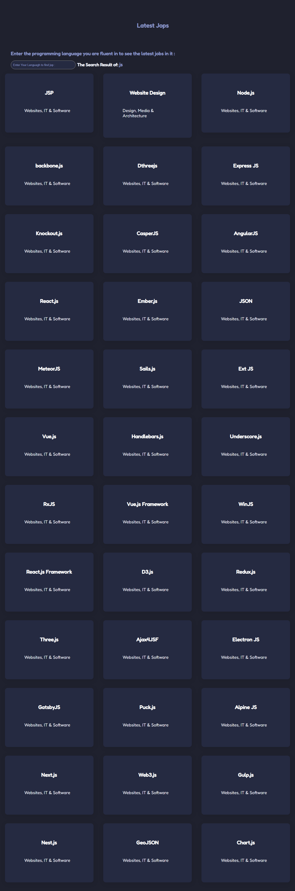

# rawan-API-task

## FreeLancer jop website

# Description 

#### This is the penultimate task in the coding foundation course, which is to display the latest jobs on the Freelancer website and display them to me on this page using the API, through the person typing the name of the programming language he masters, and then the available jobs will be displayed and to which section they belong 

### To show live page click here  <a href='https://gsg-cf05.github.io/rawan-API-task/'> API Task </a>

### During this task I used
<ul>
<li> HTML,CSS</li>
<li> Js </li>
<li> Git And Github</li>
<li> medai query "responsive design"</li>
<li> API </li>
</ul>

## Final Result

